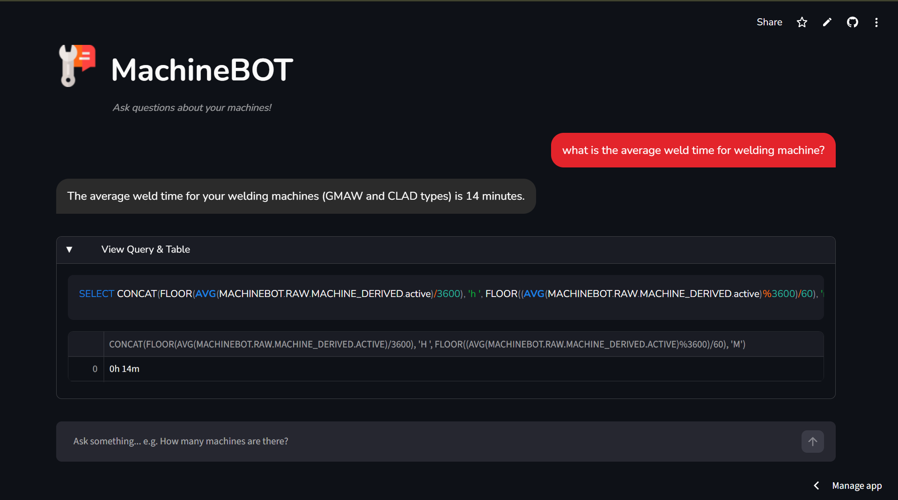
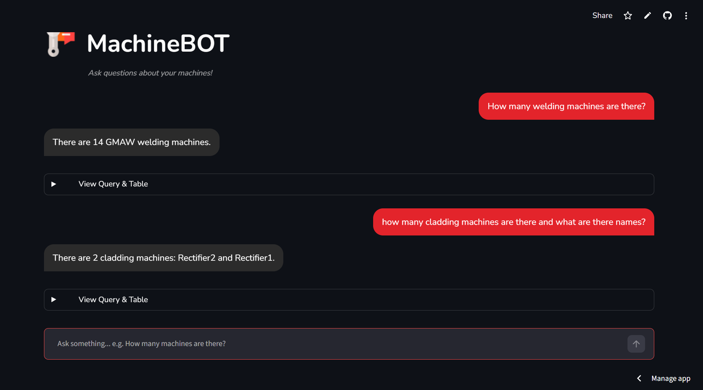
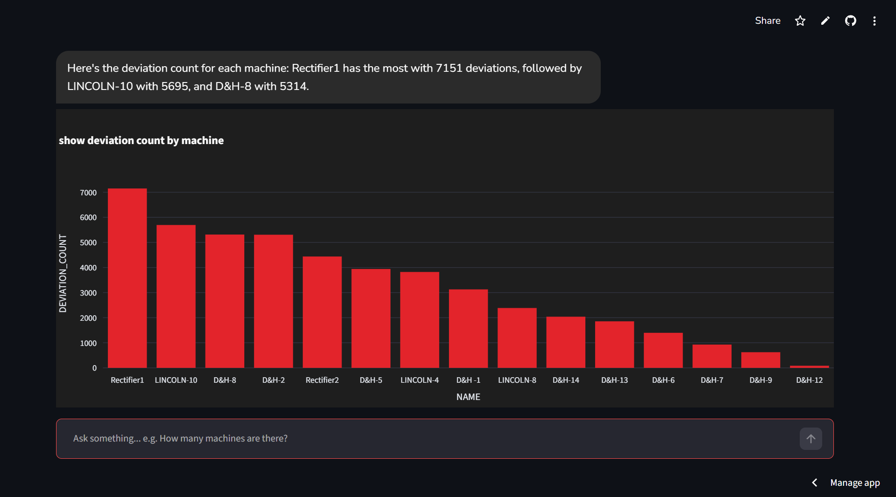
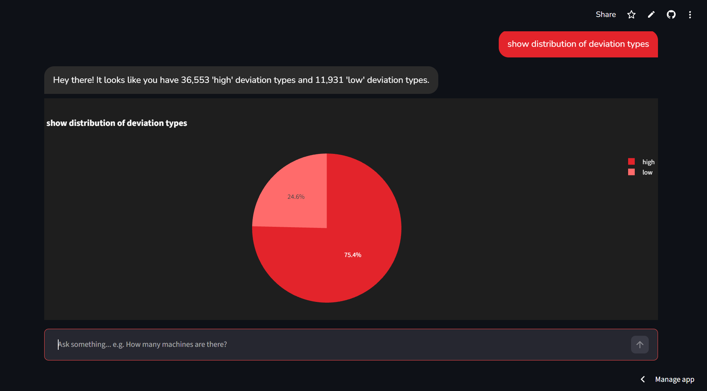
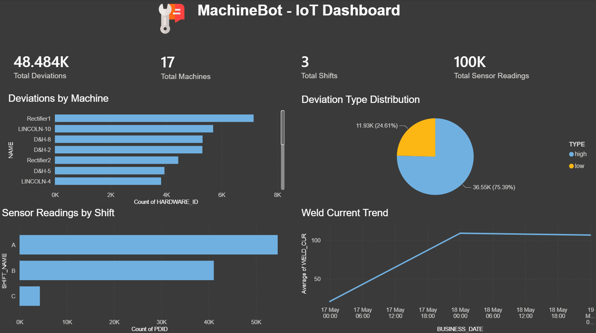
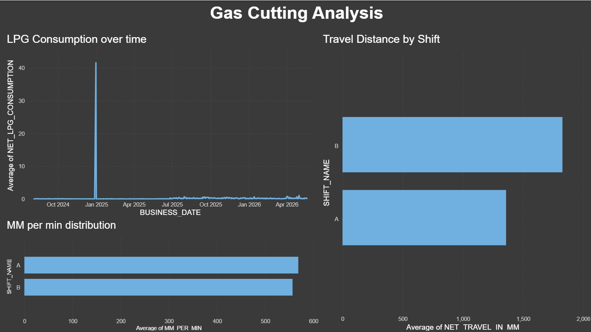

# MachineBOT — IoT Intelligence Platform

An AI-powered IoT data intelligence platform built for a steel manufacturing plant (Tata Steel), transforming raw sensor data into actionable insights through AI and interactive visualizations.

## Features

- **AI Chatbot** — Ask questions in plain English, get instant answers with auto-generated charts
- **Text-to-SQL** — Gemini AI converts natural language to SQL queries on Snowflake
- **Auto Charts** — Bar, line and pie charts generated automatically based on query results
- **Power BI Dashboard** — 4-page live dashboard connected to Snowflake via DirectQuery

## Tech Stack

| Component | Technology |
|---|---|
| AI Model | Google Gemini 2.5 Flash |
| Database | Snowflake |
| Frontend | Streamlit |
| Charts | Plotly |
| Data Processing | Python, Pandas |
| Dashboard | Power BI |

## Dataset

- 9 IoT sensor CSV files
- 247,000+ rows of machine data
- 17 physical machines (GMAW, Cladding, Gas Cutting)
- 3 shifts (A, B, C)

## Setup

1. Clone the repository:
\```bash
git clone https://github.com/stellarkp1011/MachineBot.git
\```

2. Install dependencies:
\```bash
pip install streamlit snowflake-connector-python google-genai plotly pandas python-dotenv
\```

3. Create a `details.env` file:
\```
GEMINI_API_KEY=my_gemini_api_key
SNOWFLAKE_ACCOUNT=my_account
SNOWFLAKE_USER=my_username
SNOWFLAKE_PASSWORD=my_password
SNOWFLAKE_DATABASE=MACHINEBOT
SNOWFLAKE_SCHEMA=RAW
\```

4. Run the chatbot:
\```bash
streamlit run app.py
\```

## Screenshots

### MachineBOT Chatbot

**Answering questions with plain English:**


**Multiple questions in chat history:**


**Auto-generated Bar Chart:**


**Auto-generated Pie Chart:**


### Power BI Dashboard

**Overview Page:**


**Gas Cutting Analysis:**


## Author

Kirti Pandey — AI & Data Science Intern, Tata Steel